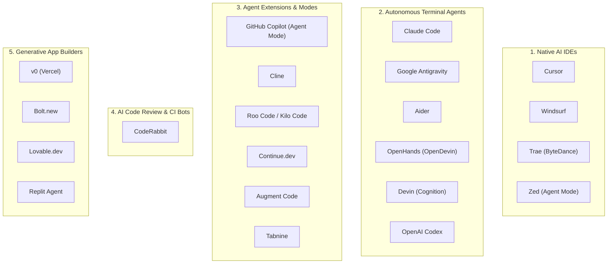

# Universal AI Tools Playbook (21 Tools Supported)

Auterix provides native configuration, command workflows, and context synchronization for 21 leading AI coding assistants, autonomous agents, and generative platforms.

---

## 🧭 The 5 AI Tool Categories

---

## 🛠️ Detailed Tool Integration Directory

### Category 1: Native AI IDEs

#### 1. Cursor
* **Config Files:** `.cursor/rules/workflow.mdc`, `.cursor/rules/agents.mdc`, `.cursor/rules/security.mdc`, `.cursor/commands/`, `.cursorrules`
* **How it works:** Cursor's MDC rules system automatically detects `.cursor/rules/` and enforces your architecture boundaries during completions and composer tasks.
* **Commands:** Type `/plan`, `/review`, `/test` in Cursor Composer.

#### 2. Windsurf (Codeium)
* **Config Files:** `.windsurf/rules/workflow.md`, `.windsurf/workflows/plan.md`, `.windsurf/workflows/review.md`
* **How it works:** Windsurf Cascade inspects `.windsurf/rules/` for global invariants and surfaces workflows as native action buttons.
* **Commands:** Run `/plan` or `/review` directly in Cascade chat.

#### 3. Trae (ByteDance)
* **Config Files:** `.trae/rules/project.md`, `.traerules`
* **How it works:** Trae's AI IDE engine parses `.trae/rules/` to load context boundaries, package conventions, and protected database files.
* **Commands:** Prompts automatically link into the active task in `.ai/tasks/active.json`.

#### 4. Zed (AI Agent Mode)
* **Config Files:** `.zed/settings.json`, `.zed/prompts/`
* **How it works:** Zed uses project-level slash commands and contextual prompts configured in `.zed/settings.json`.
* **Commands:** Run `/plan` or `/fix` in Zed Assistant panel.

---

### Category 2: Autonomous Terminal Agents

#### 5. Claude Code (Anthropic CLI)
* **Config Files:** `CLAUDE.md`, `.claude/commands/`, `.claude/skills/`, `.claudeignore`
* **How it works:** Claude Code loads `CLAUDE.md` as its primary project memory. Auterix adds custom verification commands (`/plan`, `/implement`, `/review`, `/test`, `/fix`, `/pr`) and skills (`verification-gate`, `security-guard`).
* **Commands:** Run `claude` in terminal and use `/implement` or `/review`.

#### 6. Google Antigravity
* **Config Files:** `.agents/rules/workflow.md`, `.agents/skills/`, `.agents/agents/`
* **How it works:** Google Antigravity uses multi-agent roles (`planner.md`, `code-reviewer.md`, `test-writer.md`) and scoped skills to execute complex tasks autonomously with verification gates.
* **Commands:** Automatic agent delegation based on active milestone in `.ai/tasks/active.json`.

#### 7. Aider
* **Config Files:** `.aider.conf.yml`, `CONVENTIONS.md`, `.aiderignore`
* **How it works:** Aider automatically loads `CONVENTIONS.md` into its context memory on startup, ensuring commits and edits follow your stack standards.
* **Commands:** Launch `aider`—it automatically applies the Auterix context.

#### 8. OpenHands (Formerly OpenDevin)
* **Config Files:** `.openhands_instructions`, `.openhands/microagents/`
* **How it works:** OpenHands autonomous agent reads `.openhands_instructions` at the workspace root before starting any task or executing bash commands.
* **Commands:** Start OpenHands—it obeys the declared verification gates and safety invariants.

#### 9. Devin (Cognition)
* **Config Files:** `AGENTS.md`, `DEVIATION.md`, `.devin/playbook.md`
* **How it works:** When Devin clones your repository or receives a ticket, it consults `AGENTS.md` and the playbook to run pre-verification checks before opening PRs.
* **Commands:** Autonomous ticket resolution according to `.ai/manifest.json`.

#### 10. OpenAI Codex (Agent / Desktop)
* **Config Files:** `AGENTS.md`, `.ai/manifest.json`, `.ai/tasks/active.json`
* **How it works:** Implements the official OpenAI `AGENTS.md` specification with precedence checking (`AGENTS.override.md`).
* **Commands:** Fully supported across OpenAI Desktop and CLI agent integrations.

---

### Category 3: Agent Extensions & Modes

#### 11. GitHub Copilot (Agent Mode)
* **Config Files:** `.github/copilot-instructions.md`, `.copilot/rules.md`, `.github/prompts/`
* **How it works:** Copilot Agent Mode reads `.github/copilot-instructions.md` on every chat turn and surfaces custom prompt templates.
* **Commands:** Use `/plan`, `/review`, or `/test` in Copilot Chat.

#### 12. Cline (VS Code Extension)
* **Config Files:** `.clinerules`, `.clineignore`
* **How it works:** Cline loads `.clinerules` at the start of every autonomous task, preventing unauthorized file deletions or untyped edits.
* **Commands:** Select task in Cline panel; Auterix boundaries are enforced automatically.

#### 13. Roo Code / Kilo Code
* **Config Files:** `.roomodes`, `.clinerules`
* **How it works:** Configures specialized custom modes (**Architect**, **Code**, **Ask**, **Test**) so the AI dynamically switches personas depending on the phase of the Auterix workflow.
* **Commands:** Switch modes in the dropdown menu for tailored task execution.

#### 14. Continue.dev
* **Config Files:** `.continue/rules/workflow.md`, `.continue/config.json`
* **How it works:** Popular open-source VS Code / JetBrains extension. Loads custom context rules and slash commands from `.continue/`.
* **Commands:** Run `/plan` or `/review` in the Continue sidebar.

#### 15. Augment Code
* **Config Files:** `.augment/rules/workflow.md`, `.augmentrules`
* **How it works:** Enterprise-grade contextual agent that indexes `.augment/rules/` for repository-wide adherence.
* **Commands:** Fully synchronized with all other active adapters.

#### 16. Tabnine
* **Config Files:** `.tabnine/rules.json`
* **How it works:** Tabnine Enterprise AI assistant respects security boundaries, test commands, and package restrictions declared in the rules file.

---

### Category 4: AI Code Review & CI Bots

#### 17. CodeRabbit
* **Config Files:** `.coderabbit.yaml`
* **How it works:** Automated AI code reviewer installed on your GitHub/GitLab repository. 
* **Auterix Integration:** The generated `.coderabbit.yaml` instructs CodeRabbit to:
  * Check PRs against the project's `.ai/manifest.json` and active tasks.
  * Halt reviews if database migrations violate Supabase RLS standards.
  * Verify that newly added features include unit or Playwright E2E tests.

---

### Category 5: Generative App Builders

#### 18. v0 by Vercel
* **Config Files:** `.prompts/v0-system-prompt.md`, `README.md`
* **How it works:** When building UI or fullstack prototypes in v0, paste the Auterix v0 System Prompt into the chat to force v0 to use Next.js 15 App Router conventions, clean component boundaries, and zero inline CSS.

#### 19. Bolt.new (StackBlitz)
* **Config Files:** `.prompts/bolt-system-prompt.md`
* **How it works:** Use the Auterix Bolt prompt when prompting Bolt.new to scaffold projects that cleanly separate server logic, client state, and database queries.

#### 20. Lovable.dev
* **Config Files:** `.prompts/lovable-system-prompt.md`
* **How it works:** Guides Lovable to produce clean, modular Supabase database schemas and TypeScript interfaces ready for immediate git commit.

#### 21. Replit Agent
* **Config Files:** `.replit`, `replit.nix`, `.replit/instructions.md`
* **How it works:** Replit Agent detects `.replit/instructions.md` and your pre-configured run scripts to safely build, execute, and verify web applications inside Replit.

---

## 🔄 Cross-Tool Handoff Example

Because all 21 tools read from the **same `.ai/` state machine**, you can seamlessly switch tools without losing context:

1. **Step 1:** Draft an architectural plan in **Cursor** using `/plan`. Cursor writes the task to `.ai/tasks/active.json`.
2. **Step 2:** Switch to **Claude Code** in terminal. Type `/implement`. Claude reads the active task and writes the backend logic.
3. **Step 3:** Open **Google Antigravity** or **Cline** to run test writing and verification.
4. **Step 4:** Push to GitHub. **CodeRabbit** and the **Auterix CI Bot** review the PR against your architectural rules before merging.
