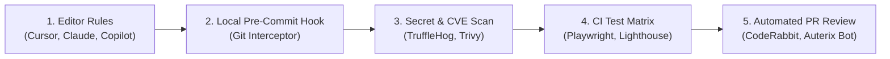

# CI/CD & Automated Quality Gates

Auterix doesn't just stop at AI prompts—it gives teams automated guardrails to verify AI code before it ever reaches production.

---

## 🛡️ The 5 Layers of AI Quality Enforcement



---

## 1. Local Pre-Commit Guardrail (`blueprints/ci-cd/pre-commit-guard.sh`)

The first line of defense runs on every `git commit` directly on the developer's laptop before code is pushed:
* **Secret Leak Prevention:** Blocks staged `.env`, `.env.local`, and high-entropy secret patterns (Stripe keys, GitHub PATs, Slack tokens, JWT service keys).
* **TypeScript Compilation Gate:** Automatically invokes `tsc --noEmit` to ensure no broken types or missing imports slip into commits.
* **Auterix Architectural Lock Check:** Runs `node bin/workflow.mjs check` to guarantee adapter configurations remain in sync.

```bash
# Setup with Husky:
npx husky add .husky/pre-commit "bash blueprints/ci-cd/pre-commit-guard.sh"
```

---

## 2. Automated Vulnerability & Secret Scanning (`blueprints/ci-cd/security-scan.yml`)

Runs on pull requests, pushes to `main`, and on a daily schedule (`03:00 UTC`):
* **TruffleHog OSS Secret Scanner:** Deeply scans git commit history for verified active API keys and credentials.
* **Trivy File System & Dependency Scan:** Detects CVE vulnerabilities across `package-lock.json` and third-party dependencies with severity threshold `CRITICAL,HIGH`.
* **Trivy Container Scan:** Automatically builds the production Docker image and inspects base OS packages and layers for vulnerabilities.
* **Auterix Verification:** Enforces architectural rule conformance in CI.

---

## 3. Playwright E2E Testing Suite (`blueprints/ci-cd/playwright.config.ts`)

AI models are notorious for writing code that compiles but fails when a real user clicks through the browser. Auterix includes a modern Playwright end-to-end testing scaffold.

### Configuration
* Configured for **Chromium, Firefox, WebKit, and Mobile Chrome**.
* Runs a local dev server automatically during test execution.
* Captures screenshots and video traces on test failures.

### AI Command Integration
Auterix provides custom prompts so AI assistants can run and author Playwright tests:
* In Claude Code: `/test:e2e`
* In Cursor Composer: `/test "run playwright e2e tests"`
* In CI: `npx playwright test --reporter=html`

---

## 4. Lighthouse CI (Core Web Vitals & A11y) (`blueprints/ci-cd/lighthouserc.js`)

Never let an AI assistant introduce slow bundle sizes, layout shifts, or inaccessible HTML into your production frontend.

### Configuration
Auterix configures strict Lighthouse CI assertion budgets:
* **Performance:** Score >= 90 (LCP under 2.5s, CLS under 0.1)
* **Accessibility:** Score >= 95 (proper ARIA labels, semantic buttons, valid contrast)
* **Best Practices:** Score >= 95 (HTTPS, modern image formats, clean console)
* **SEO:** Score >= 95 (valid meta tags, structured data)

---

## 5. CodeRabbit AI PR Review Automation (`blueprints/ci-cd/coderabbit.yaml`)

CodeRabbit is the leading AI-powered code review tool for GitHub and GitLab. Auterix provides an optimized `.coderabbit.yaml` that turns CodeRabbit into an automated architectural gatekeeper.

### What the Auterix CodeRabbit Config Enforces:
1. **Architecture Boundaries:** Rejects PRs where client components make direct SQL queries or bypass backend services.
2. **Supabase RLS Auditing:** Flags any newly created PostgreSQL table that lacks a corresponding `ALTER TABLE ... ENABLE ROW LEVEL SECURITY;` policy.
3. **Task State Verification:** Confirms that changes correspond to an approved task in `.ai/tasks/`.
4. **Zero Untyped Any:** Highlights any `any` types in TypeScript code.

---

## 6. Unified GitHub Actions CI Pipeline (`blueprints/ci-cd/github-ci.yml`)

Auterix provides a single, turnkey CI matrix that runs on every pull request:
1. **Lint & Typecheck:** `npm run lint` && `npm run typecheck`
2. **Unit Tests:** `npm test`
3. **E2E Tests:** `npx playwright test`
4. **Lighthouse Audit:** `lhci autorun`
5. **Auterix Verification:** `npx auterix check`

With this pipeline active, human code reviewers never have to waste time reviewing unformatted code, broken tests, or AI hallucinations.
